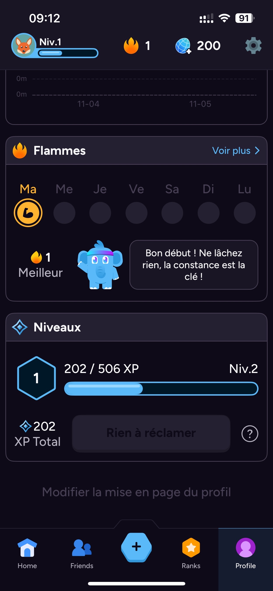
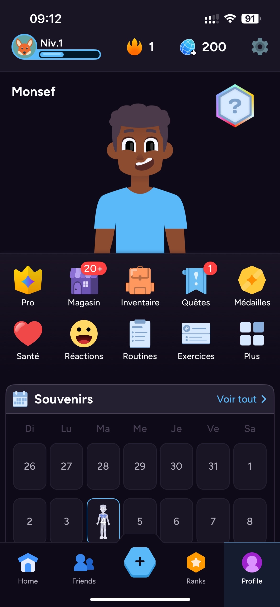

# expo-app-entrainement

**FR** — Application mobile **React Native (Expo)** de suivi d'**entraînement** : planification des séances, statistiques, profil utilisateur et calendrier.

**EN** — A **React Native (Expo)** **workout-tracking** mobile app: session planning, statistics, user profile and calendar.

---

## Fonctionnalités / Features

- **FR**
  - Écrans dédiés : entraînements, statistiques, profil, complétion de profil, accueil.
  - Authentification (connexion / inscription) via une API backend.
  - Calendrier interactif (`react-native-calendars`) et navigation par onglets + pile.
  - Couche services et modèles séparés (ex. `UserCredentials`).
- **EN**
  - Dedicated screens: workouts, statistics, profile, complete-profile, home.
  - Authentication (login / sign-up) via a backend API.
  - Interactive calendar (`react-native-calendars`) with tab + stack navigation.
  - Separate service and model layers (e.g. `UserCredentials`).

## Captures d'écran / Screenshots

| Profil & progression | Accueil | Classement / Ranks |
|:---:|:---:|:---:|
|  |  |  |

## Stack

JavaScript · React Native · Expo · React Navigation.

## Configuration & lancement / Setup & run

```bash
npm install
npx expo start
```

> **FR** : les identifiants d'API sont dans `services/config.js` (valeur d'exemple `PLACEHOLDER_BASE64_USER_PASSWORD`). Aucun identifiant réel n'est versionné.
> **EN**: API credentials live in `services/config.js` (placeholder `PLACEHOLDER_BASE64_USER_PASSWORD`). No real credential is committed.
